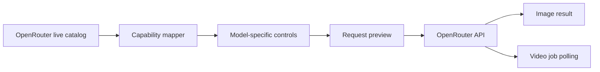

<div align="center">

# OpenGen UI

### One clean workspace for image and video generation

Choose an OpenRouter model, see only the controls it supports, and inspect the exact request before you generate.

[](#project-status)
[](https://tauri.app/)
[](https://react.dev/)
[](https://www.typescriptlang.org/)
[](https://www.rust-lang.org/)

**English** · [한국어](./docs/i18n/README.ko.md) · [简体中文](./docs/i18n/README.zh-CN.md) · [日本語](./docs/i18n/README.ja.md) · [Español](./docs/i18n/README.es.md)

<br />


<br />

[Why OpenGen UI?](#why-open-gen-ui) · [Features](#features) · [How it works](#how-it-works) · [Quick start](#quick-start) · [Security](#security) · [Development](#development)

</div>

---

> **OpenGen UI** turns OpenRouter's live model metadata into a focused desktop workspace. Pick a model, compose a valid request, preview the JSON, and generate without rebuilding your form for every provider.

## Why OpenGen UI?

Generation models rarely agree on inputs. One supports seed and aspect ratio; another expects first and last frames; a third accepts several reference images. OpenGen UI reads those capabilities at runtime and adapts the workspace to the selected model.

| Without OpenGen UI | With OpenGen UI |
| --- | --- |
| Cross-check provider docs for every model | Controls are derived from the live model catalog |
| Guess which fields are valid | Unsupported options stay out of the request |
| Handcraft JSON and image data URLs | References and parameters are mapped for you |
| Build custom polling for video jobs | Active jobs are restored and polled to completion |

## Features

- **Live model discovery** — loads image and video catalogs directly from OpenRouter.
- **Capability-aware controls** — renders only the parameters supported by the selected model.
- **Image and video workflows** — handles image results as well as asynchronous video jobs.
- **Flexible references** — maps uploads to general references, first frames, or last frames when supported.
- **Request inspector** — shows the exact JSON payload before anything is sent and omits large base64 bodies from the preview.
- **Advanced routing** — accepts optional provider routing and passthrough settings as JSON.
- **Job continuity** — remembers an active video job and resumes polling after a restart.
- **Local credential storage** — keeps the OpenRouter API key in the desktop app's local data, outside request previews and logs.

## How it works



1. OpenGen UI fetches the live image and video model catalogs.
2. The selected model's metadata determines which inputs, references, and options appear.
3. Your prompt and settings are converted into a provider-valid request.
4. You can inspect the sanitized request JSON before generating.
5. Images render immediately; video jobs are persisted and polled until they finish.

## Quick start

### Prerequisites

| Requirement | Notes |
| --- | --- |
| Node.js | Version 24 or newer |
| Rust | Current stable toolchain |
| Tauri prerequisites | Platform dependencies from the [Tauri setup guide](https://v2.tauri.app/start/prerequisites/) |
| OpenRouter API key | Create one in [OpenRouter settings](https://openrouter.ai/settings/keys) |

### Run the desktop app

```bash
git clone https://github.com/jbaehova/open-gen-ui.git
cd open-gen-ui/apps/desktop
npm install
npm run tauri:dev
```

When the app opens, add your OpenRouter API key in **Settings**. The model catalogs will load automatically.

## Security

In the Tauri desktop app, the OpenRouter key is stored at:

```text
~/.open-gen-ui/credentials.json
```

- On macOS and Linux, the directory is restricted to `0700` and the credential file to `0600`.
- The key is masked in the interface and excluded from request previews and application logs.
- Network calls are proxied through the Rust process, which only permits the OpenRouter paths used by the app.
- Generated video files are cached in the operating system's application cache directory.

> [!NOTE]
> The browser-only Vite development view uses local storage as a development fallback. Use the Tauri app for desktop credential handling.

## Development

Run checks from `apps/desktop`:

```bash
npm run test:unit
npm run check
npm run build
cd src-tauri && cargo test
```

### Project structure

```text
open-gen-ui/
├── apps/desktop/
│   ├── src/                 # React workspace and request builder
│   └── src-tauri/           # Credential storage and OpenRouter proxy
└── assets/readme/           # README artwork
```

The request-building logic lives in `apps/desktop/src/openrouter.ts`; the native security boundary and OpenRouter proxy live in `apps/desktop/src-tauri/src/lib.rs`.

## Project status

OpenGen UI is currently **beta software**. The request layer and core desktop workflow are in place, while packaging, release automation, and broader provider coverage are still evolving.

<div align="center">

Built for creators who want model flexibility without request-shape busywork.

[Back to top](#open-gen-ui)

</div>
