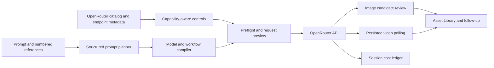

<div align="center">

# Fruit Truck

### One focused macOS studio for image and video generation

Explore OpenRouter models, shape a request around each model's real capabilities, and keep every input and result in one workspace.

[](#project-status)
[](#download)
[](https://tauri.app/)
[](https://react.dev/)
[](https://www.typescriptlang.org/)

**English** · [한국어](./docs/i18n/README.ko.md) · [简体中文](./docs/i18n/README.zh-CN.md) · [日本語](./docs/i18n/README.ja.md) · [Español](./docs/i18n/README.es.md)

<br />


<br />

[Why Fruit Truck?](#why-fruit-truck) · [Features](#features) · [How it works](#how-it-works) · [Download](#download) · [Quick start](#quick-start) · [Security](#security-and-local-data) · [Development](#development)

</div>

---

> **Fruit Truck** turns OpenRouter's live model and endpoint metadata into a full-window generation workspace. Choose a model, attach references with explicit roles, inspect the request that will actually be sent, and continue from the results without rebuilding your workflow for every provider.

## Why Fruit Truck?

Image and video models rarely agree on their inputs. One exposes seed and aspect ratio, another accepts first and last frames, and another supports a mixture of image, video, and audio references. Even the meaning of a reference can change from identity to style, composition, or motion.

Fruit Truck adapts the workspace and request to the selected model instead of asking you to memorize those differences.

| Without Fruit Truck | With Fruit Truck |
| --- | --- |
| Cross-check model and provider documentation | Controls come from live catalog and endpoint capabilities |
| Guess which options and reference types are valid | Unsupported combinations are caught before submission |
| Hope every attached reference influences the right thing | Numbered inputs have explicit purposes and visible request mappings |
| Rewrite prompts by hand for each model family | Structured enhancement compiles the intent for the selected model and workflow |
| Build separate polling and file-management flows | Video jobs, generated media, and session costs stay in one workspace |

## Features

- **Guided first run** — introduces the workflow and connects one OpenRouter API key before opening the studio.
- **Live model and price discovery** — loads image and video catalogs, endpoint capabilities, and published pricing from OpenRouter.
- **Capability-aware controls** — renders supported options, clamps constrained values, and validates provider-specific passthrough fields against the selected endpoint.
- **Model-aware prompt enhancement** — turns the original intent into a structured plan, then compiles it with a profile suited to the target image or video model. Enhancement can be enabled once for every current and future thread.
- **Reference contracts** — assigns stable `@1`, `@2`, … inputs a purpose such as subject identity, product identity, style, composition, pose, motion, audio, or context. Required mappings are verified before generation; optional gaps remain visible as warnings.
- **Image and video workflows** — supports text generation, multi-reference composition, first/last-frame video, image editing, and semantic-mask edits according to the selected model's declared support.
- **Independent generation threads** — keeps image and video prompts, models, options, attempts, and background work isolated while several ideas progress in parallel.
- **Request inspector** — shows the provider-facing prompt, numbered-input mapping, native transport field, and sanitized JSON without embedding local media bodies.
- **Result follow-up** — reviews generated candidates and can reuse a result as a new input, an image-edit target, or a video reference.
- **Job and cost continuity** — restores active video polling, records attempt history, and keeps estimated or actual generation and enhancement costs in a per-session ledger.
- **Asset Library** — imports and previews image, video, and audio files; filters, reuses, deletes, and exports managed results to Downloads.
- **Desktop-native workflow** — provides macOS menus and shortcuts, a maximized full-window layout, English and Korean UI, and signed in-app updates.
- **Managed local data** — keeps uploads, generated media, session state, and credentials on the Mac instead of placing Base64 media in saved metadata.

## How it works



1. Fruit Truck fetches OpenRouter's image and video catalogs, their prices, and the capabilities needed to build a valid request.
2. Each generation thread keeps its own mode, model, prompt, numbered inputs, and options.
3. When prompt enhancement is enabled, the selected planner preserves the original intent and creates reference-by-reference instructions for the active workflow and target model.
4. Fruit Truck compiles the final provider prompt, removes unsupported fields, validates reference coverage and provider options, and exposes the sanitized result in **Request preview**.
5. Images enter candidate review immediately. Video jobs remain attached to the session and resume polling after the app is reopened.
6. Accepted outputs are materialized in managed local storage and can be exported or routed into the next generation.

## Download

Fruit Truck currently ships for **Apple Silicon Macs only**. Intel Macs are not supported.

[Download the latest notarized DMG](https://github.com/jbaehova/fruit-truck/releases/latest/download/Fruit-Truck-macOS-universal.dmg) or review the version notes on [GitHub Releases](https://github.com/jbaehova/fruit-truck/releases/latest).

The stable asset filename contains `universal`, but the release workflow and bundled executable target `aarch64-apple-darwin`. Installed builds include the native media-inspection tool they need; app users do not need Node.js, Rust, Homebrew, or a separate FFmpeg installation.

After installing, open Fruit Truck and follow the one-minute setup to save an [OpenRouter API key](https://openrouter.ai/settings/keys). The app checks signed updates and can install them without replacing the workspace manually.

## Quick start

### Build from source

| Requirement | Notes |
| --- | --- |
| Node.js | Version 24 or newer |
| Rust | Current stable toolchain |
| Tauri prerequisites | Platform dependencies from the [Tauri setup guide](https://v2.tauri.app/start/prerequisites/) |
| FFprobe | Required on `PATH` in development for local video and audio metadata inspection |
| OpenRouter API key | Create one in [OpenRouter settings](https://openrouter.ai/settings/keys) |

The repository runner checks the local toolchain, installs JavaScript dependencies when needed, and opens the maximized Tauri app:

```bash
git clone https://github.com/jbaehova/fruit-truck.git
cd fruit-truck
./run.sh
```

Or run the desktop package directly:

```bash
cd apps/desktop
npm ci
npm run tauri:dev
```

For the browser-only development view, run `./run.sh --web` from the repository root or `npm run dev` from `apps/desktop`. Native credential and managed-file behavior is available in the Tauri app; the browser view uses development fallbacks.

### Create your first generation

1. Add the OpenRouter key during first-run setup. It can be changed later in **Settings**.
2. Choose an image or video thread and select a model by capability and price.
3. Write the prompt and, when useful, drag media from the Asset Library into the input tray.
4. Set the purpose and transport role of every reference. Use `@1`, `@2`, and so on when referring to a specific input in the prompt.
5. Keep prompt enhancement on for a model-aware rewrite, or turn it off to send the original prompt through the same request validation.
6. Open **Request** to verify the final JSON and reference mapping, then generate and continue from the result.

## Security and local data

The Tauri app stores its data under `~/.fruit-truck` by default:

```text
~/.fruit-truck/
├── credentials.json   # OpenRouter API key
├── assets/            # Imported source media
└── generated/         # Materialized image and video results
```

- On Unix systems, Fruit Truck creates its private data directory with `0700` permissions and credential and managed-media files with `0600` permissions.
- The API key is masked in the interface and excluded from request previews and application logs.
- The key is attached only by the Rust process, whose proxy accepts the specific OpenRouter catalog, generation, endpoint, and job paths used by the app.
- Request previews replace local media payloads with readable placeholders instead of exposing Base64 data.
- Local imports reject empty files and enforce safety limits of 30 MB for images, 700 MB for videos, and 50 MB for audio.
- The browser-only development view uses local storage as a fallback. Use the Tauri app for native credential and file handling.

Set `FRUIT_TRUCK_HOME` to an absolute path before launching the app to use a different local data directory.

## Development

Run the same core checks used by CI from `apps/desktop`:

```bash
npm ci
npm run check
npm run test:unit
npm run build
npm run test:e2e
cargo test --manifest-path src-tauri/Cargo.toml
cargo clippy --manifest-path src-tauri/Cargo.toml --all-targets -- -D warnings
```

Playwright always runs headless with a 1920×1080 viewport, matching the desktop app's default maximized-window workflow.

### macOS release

`npm run bundle:mac` builds the pinned FFmpeg project source for Apple Silicon but packages only its `ffprobe` executable. The app does **not** bundle or invoke the `ffmpeg` program. FFmpeg licensing notices and build configuration remain in the bundle because FFprobe is an FFmpeg project output.

The release workflow builds, signs, notarizes, and staples the DMG, verifies the Apple Silicon app bundle, and publishes signed Tauri updater artifacts. See [docs/RELEASING.md](./docs/RELEASING.md) for the complete release contract.

### Project structure

```text
fruit-truck/
├── apps/desktop/
│   ├── e2e/              # Headless full-window Playwright coverage
│   ├── scripts/          # Release, media-tool, and contract checks
│   ├── src/              # React workspace, prompt planner, and request builder
│   └── src-tauri/        # Native storage, media inspection, and OpenRouter proxy
├── assets/readme/        # README artwork
└── docs/                 # Release and translated project guides
```

The capability mapping and provider request logic live in `apps/desktop/src/openrouter.ts`; structured prompt planning lives in `apps/desktop/src/prompting`; native storage and the OpenRouter security boundary live in `apps/desktop/src-tauri/src/lib.rs`.

## Project status

Fruit Truck is currently **beta software**. The core macOS generation workflow, signed release path, local asset handling, request validation, and automated test coverage are in place. OpenRouter catalogs, provider behavior, and model-specific policies can continue to evolve.

## Third-party notices

See [THIRD_PARTY_NOTICES.md](./THIRD_PARTY_NOTICES.md) for bundled dependency and media-tool notices.

<div align="center">

Built for creators who want model flexibility without request-shape busywork.

[Back to top](#fruit-truck)

</div>
