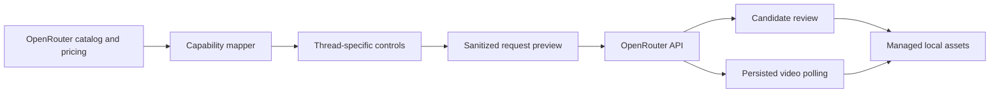

<div align="center">

# Fruit Truck

### One clean workspace for image and video generation

Choose an OpenRouter model, see only the controls it supports, and inspect the exact request before you generate.

[](#project-status)
[](https://tauri.app/)
[](https://react.dev/)
[](https://www.typescriptlang.org/)
[](https://www.rust-lang.org/)

**English** · [한국어](./docs/i18n/README.ko.md) · [简体中文](./docs/i18n/README.zh-CN.md) · [日本語](./docs/i18n/README.ja.md) · [Español](./docs/i18n/README.es.md)

<br />


<br />

[Why Fruit Truck?](#why-fruit-truck) · [Features](#features) · [How it works](#how-it-works) · [Quick start](#quick-start) · [Security](#security) · [Development](#development)

</div>

---

> **Fruit Truck** turns OpenRouter's live model metadata into a focused desktop workspace. Pick a model, compose a valid request, preview the JSON, and generate without rebuilding your form for every provider.

## Why Fruit Truck?

Generation models rarely agree on inputs. One supports seed and aspect ratio; another expects first and last frames; a third accepts several reference images. Fruit Truck reads those capabilities at runtime and adapts the workspace to the selected model.

| Without Fruit Truck | With Fruit Truck |
| --- | --- |
| Cross-check provider docs for every model | Controls are derived from the live model catalog |
| Guess which fields are valid | Unsupported options stay out of the request |
| Handcraft JSON and image data URLs | References and parameters are mapped for you |
| Build custom polling for video jobs | Active jobs are restored and polled to completion |

## Features

- **Guided first run** — introduces the workflow and saves the OpenRouter key locally before loading the workspace.
- **Live model and price discovery** — loads image and video catalogs and published pricing directly from OpenRouter.
- **Capability-aware controls** — renders only supported parameters, clamps numeric ranges, and keeps advanced provider routing available.
- **Image and video creation** — supports image and video generation, semantic-mask image editing, image-reference video generation, and image-aware prompt enhancement.
- **Stable numbered inputs** — copies uploads into the session and lets prompts refer to them consistently as `@1`, `@2`, and so on.
- **Independent generation threads** — keeps prompts, models, options, history, and background work isolated across parallel image and video generation tabs.
- **Request inspector** — shows sanitized request JSON without embedding media bodies.
- **Result review and follow-up** — reviews generated candidates, then starts an image edit, video generation, or new-input flow from the selected result.
- **Job and cost continuity** — restores active jobs, polls videos to completion, and tracks attempt history with estimated or actual cost.
- **Agent-first, visual decisions** — start in Codex, Claude Code, or Hermes; Fruit Truck stays in the background until you open rich media, model, upload, assembly, or approval checkpoints.
- **Codex-native images** — Codex sessions choose once between built-in image generation/editing and OpenRouter; Claude Code and Hermes remain on OpenRouter.
- **Shared control** — the right `Agent / Assets` panel keeps status, current action, progress, pause/stop, and handover controls beside the unchanged generation canvas.
- **Native Mac controls** — keyboard shortcuts, menus, focused-item navigation, and modal-scoped commands keep the full-window workspace fast to operate.
- **Traceable output** — provenance and evaluation stay available in each Asset preview without adding a dashboard to the main workspace.
- **Managed local media** — uploads live under `~/.fruit-truck/assets`; generated and assembled results live under `~/.fruit-truck/generated`, with actual media formats and requested image dimensions preserved.
- **Local credential storage** — keeps the OpenRouter API key in the desktop app's local data, outside request previews and logs.

## How it works



1. On first run, Fruit Truck guides you through adding an OpenRouter API key stored only on the device.
2. It fetches live image and video catalogs, capabilities, endpoint availability, and published pricing.
3. Each generation thread keeps its own mode, model, prompt, numbered `@inputs`, and options.
4. Your settings are converted into a provider-valid request that you can inspect without embedded media bodies.
5. Images enter candidate review immediately; video jobs persist and continue polling in the background.
6. Selected results are saved as local assets and can flow directly into image edits, image-guided video generation, or later requests.

## Quick start

### Prerequisites

These requirements are for building Fruit Truck from source. People installing
the DMG do not need Node.js, Rust, Homebrew, FFmpeg, or FFprobe.

| Requirement | Notes |
| --- | --- |
| Node.js | Version 24 or newer |
| Rust | Current stable toolchain |
| Tauri prerequisites | Platform dependencies from the [Tauri setup guide](https://v2.tauri.app/start/prerequisites/) |
| OpenRouter API key | Create one in [OpenRouter settings](https://openrouter.ai/settings/keys) |

### Run the desktop app

```bash
git clone https://github.com/jbaehova/fruit-truck.git
cd fruit-truck/apps/desktop
npm ci
npm run tauri:dev
```

You can also run `./run.sh` from the repository root. It requires Node.js 24+
and can select an installed Node 24+ executable even when an older Node remains
first on `PATH`. On macOS it launches the development process with the visible
name **Fruit Truck**. To use the browser-only development view, run
`./run.sh --web` or `npm run dev` from `apps/desktop`.

Source-tree desktop rendering uses `ffmpeg` and `ffprobe` from the developer's
`PATH`. Homebrew is one optional way to obtain them, not a project requirement.
Release DMGs bundle their own Universal executables.

On a fresh install, the first-run guide connects your OpenRouter API key before opening the workspace. You can change the key later in **Settings**; the model catalogs load automatically.

### Connect a local agent

The macOS app bundles everything Fruit Truck needs to work with Codex, Claude Code, and Hermes. After installing the DMG, open Fruit Truck once. The first-run guide detects the agents already installed on the Mac and offers a **Connect** button for each one. The same controls are always available under **Settings → Agent connections**.

No separate Node.js, npm package, MCP command, Skill copy, or plugin installation is required for app users. Fruit Truck installs and updates its local connector and workflows when **Connect** is pressed. Restart the connected agent after the app confirms the change, then ask it to create something with Fruit Truck.

The repository's [Agent Kit guide](./agent-kit/README.md) remains available for source-tree development and manual integration testing. The package compatibility manifest currently supports desktop `>=0.6.0 <0.7.0`.

Start from the local agent with a rough intent such as “Make a 15-second reel about discovering a perfume in an old shop on a rainy night.” The agent creates the session and checks Fruit Truck presence before claiming it. On macOS, an installed app may start in the background but never requests foreground focus. Textual story ambiguity stays in agent chat; media, model, upload, assembly, and approval checkpoints wait durably in Fruit Truck until you open them.

In a Codex-controlled session, the first image task opens a Fruit Truck choice between Codex built-in image generation and OpenRouter; that choice lasts for the session. OpenRouter model choices include published price information when available. The agent prepares final clip order and ranges, then the user reviews and renders them in **Make final video**. Distributed macOS builds use the bundled LGPL FFmpeg/FFprobe executables for MP4, MOV, and WebM input, then encode the final H.264 file through Apple's VideoToolbox hardware path when available.

Uploads are copied into `~/.fruit-truck/assets`; generated media and legacy IndexedDB-only assets are materialized into managed storage before the bridge publishes them. Session and bridge JSON store `localPath` metadata rather than Base64 media payloads. Local imports reject empty files and enforce safety limits of 30 MB for images and 700 MB for videos.

## Security

In the Tauri desktop app, the OpenRouter key is stored at:

```text
~/.fruit-truck/credentials.json
```

- On macOS and Linux, the directory is restricted to `0700` and the credential file to `0600`.
- The key is masked in the interface and excluded from request previews and application logs.
- Network calls are proxied through the Rust process, which only permits the OpenRouter paths used by the app.
- Generated video files shared with local agents are restricted to `~/.fruit-truck/generated`.

> [!NOTE]
> The browser-only Vite development view uses local storage as a development fallback. Use the Tauri app for desktop credential handling.

## Development

Run checks from `apps/desktop`:

```bash
npm run test:unit
npm run check
npm run build
npm run test:e2e
cd src-tauri && cargo test
```

Playwright runs headless at 1920×1080 and covers first-run onboarding in both app languages, the full-window Agent/Assets layout, passive decision badges, visual review, Assembly, and Agent Skill management.

### macOS media packaging

`npm run bundle:mac:universal` builds FFmpeg 8.1.2 from its verified source
archive for Apple Silicon and Intel, combines both slices, validates that they
link only to macOS system libraries, and places them in the app bundle. It then
builds the Universal DMG using `src-tauri/tauri.release.conf.json`.

The FFmpeg build disables GPL and non-free components. Rendering uses one
filter graph for trim, timestamp reset, aspect-fit scale, pad, 30 fps
normalization, and concatenation, followed by one `h264_videotoolbox` encode.
`allow_sw=1` provides an Apple software fallback if hardware encoding is
unavailable. See [third-party notices](./THIRD_PARTY_NOTICES.md) and the
[release guide](./docs/RELEASING.md).

### Project structure

```text
fruit-truck/
├── agent-kit/              # Core/Workflow Skills and MCP configuration
├── apps/desktop/
│   ├── scripts/            # Local-agent MCP server
│   ├── src/                 # React workspace and request builder
│   └── src-tauri/           # Credential storage and OpenRouter proxy
└── assets/readme/           # README artwork
```

The request-building logic lives in `apps/desktop/src/openrouter.ts`; the native security boundary and OpenRouter proxy live in `apps/desktop/src-tauri/src/lib.rs`.

## Project status

Fruit Truck is currently **beta software**. The request layer and core desktop workflow are in place, while packaging, release automation, and broader provider coverage are still evolving.

<div align="center">

Built for creators who want model flexibility without request-shape busywork.

[Back to top](#fruit-truck)

</div>
