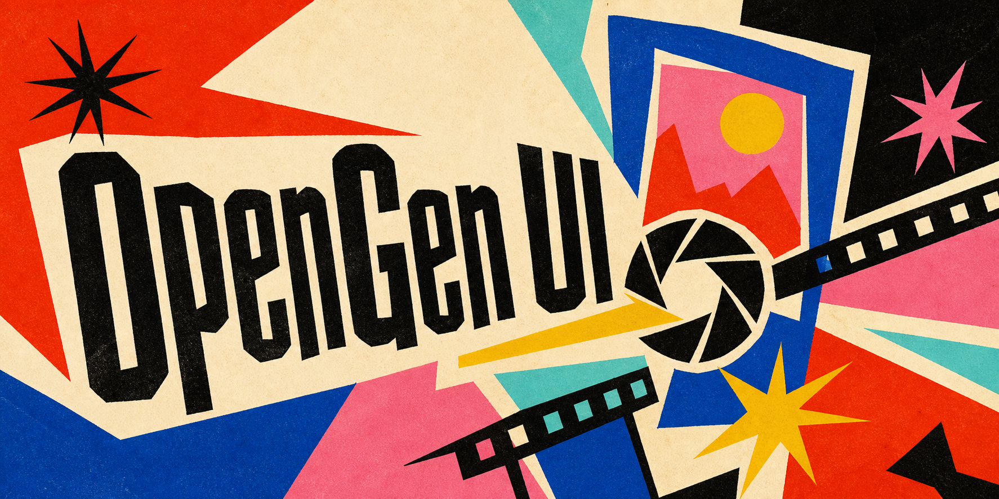
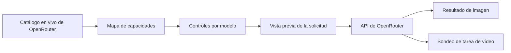

<div align="center">

# OpenGen UI

### Un espacio limpio para generar imágenes y vídeo

Elige un modelo de OpenRouter, consulta solo los controles compatibles y revisa la solicitud JSON exacta antes de generar.

[](#estado-del-proyecto)
[](https://tauri.app/)
[](https://react.dev/)
[](https://www.typescriptlang.org/)
[](https://www.rust-lang.org/)

[English](../../README.md) · [한국어](./README.ko.md) · [简体中文](./README.zh-CN.md) · [日本語](./README.ja.md) · **Español**

<br />



<br />

[¿Por qué OpenGen UI?](#por-qué-open-gen-ui) · [Funciones](#funciones) · [Cómo funciona](#cómo-funciona) · [Inicio rápido](#inicio-rápido) · [Seguridad](#seguridad) · [Desarrollo](#desarrollo)

</div>

---

> **OpenGen UI** convierte los metadatos de modelos en vivo de OpenRouter en un espacio de escritorio enfocado. Elige un modelo, crea una solicitud válida, revisa el JSON y genera sin reconstruir el formulario para cada proveedor.

## ¿Por qué OpenGen UI?

Los modelos generativos rara vez coinciden en sus entradas. Uno admite semilla y relación de aspecto; otro necesita fotogramas inicial y final; un tercero acepta varias imágenes de referencia. OpenGen UI lee estas capacidades en tiempo de ejecución y adapta el espacio al modelo elegido.

| Sin OpenGen UI | Con OpenGen UI |
| --- | --- |
| Consultar la documentación de cada modelo | Controles derivados del catálogo de modelos en vivo |
| Adivinar qué campos son válidos | Las opciones no compatibles quedan fuera de la solicitud |
| Crear JSON y URL de datos de imagen a mano | Referencias y parámetros asignados automáticamente |
| Implementar el sondeo de tareas de vídeo | Las tareas activas se restauran y consultan hasta terminar |

## Funciones

- **Descubrimiento en vivo** — carga los catálogos de modelos de imagen y vídeo directamente desde OpenRouter.
- **Controles según capacidades** — muestra únicamente los parámetros compatibles con el modelo elegido.
- **Flujos de imagen y vídeo** — procesa tanto resultados de imagen como tareas de vídeo asíncronas.
- **Referencias flexibles** — asigna archivos como referencias generales, fotogramas iniciales o finales cuando el modelo lo permite.
- **Inspector de solicitudes** — muestra el JSON exacto antes de enviarlo y omite del visor los cuerpos base64 de gran tamaño.
- **Enrutamiento avanzado** — acepta ajustes opcionales de proveedor y transferencia mediante JSON.
- **Continuidad de tareas** — recuerda una tarea de vídeo activa y reanuda el sondeo tras reiniciar.
- **Credenciales locales** — guarda la clave de OpenRouter en los datos locales de la app de escritorio, fuera de vistas previas y registros.

## Cómo funciona



1. OpenGen UI obtiene los catálogos en vivo de modelos de imagen y vídeo.
2. Los metadatos del modelo elegido determinan qué entradas, referencias y opciones aparecen.
3. El prompt y los ajustes se convierten en una solicitud válida para el proveedor.
4. Puedes inspeccionar el JSON saneado antes de generar.
5. Las imágenes aparecen al instante; las tareas de vídeo se guardan y consultan hasta finalizar.

## Inicio rápido

### Requisitos previos

| Requisito | Notas |
| --- | --- |
| Node.js | Versión 24 o superior |
| Rust | Cadena de herramientas estable actual |
| Requisitos de Tauri | Dependencias de plataforma de la [guía de configuración de Tauri](https://v2.tauri.app/start/prerequisites/) |
| Clave de OpenRouter | Créala en los [ajustes de OpenRouter](https://openrouter.ai/settings/keys) |

### Ejecutar la aplicación de escritorio

```bash
git clone https://github.com/jbaehova/open-gen-ui.git
cd open-gen-ui/apps/desktop
npm install
npm run tauri:dev
```

Cuando se abra la aplicación, añade tu clave de OpenRouter en **Settings**. Los catálogos de modelos se cargarán automáticamente.

## Seguridad

En la aplicación Tauri, la clave de OpenRouter se guarda en:

```text
~/.open-gen-ui/credentials.json
```

- En macOS y Linux, el directorio se restringe a `0700` y el archivo de credenciales a `0600`.
- La clave aparece oculta en la interfaz y se excluye de las vistas previas y los registros.
- Las llamadas de red pasan por el proceso de Rust, que solo permite las rutas de OpenRouter utilizadas por la aplicación.
- Los vídeos generados se almacenan en el directorio de caché de aplicaciones del sistema operativo.

> [!NOTE]
> La vista de desarrollo de Vite en el navegador usa almacenamiento local como alternativa de desarrollo. Usa la aplicación Tauri para gestionar credenciales de escritorio.

## Desarrollo

Ejecuta las comprobaciones desde `apps/desktop`:

```bash
npm run test:unit
npm run check
npm run build
cd src-tauri && cargo test
```

### Estructura del proyecto

```text
open-gen-ui/
├── apps/desktop/
│   ├── src/                 # Espacio React y constructor de solicitudes
│   └── src-tauri/           # Credenciales y proxy de OpenRouter
└── assets/readme/           # Recursos gráficos del README
```

La lógica de solicitudes está en `apps/desktop/src/openrouter.ts`; el límite de seguridad nativo y el proxy de OpenRouter están en `apps/desktop/src-tauri/src/lib.rs`.

## Estado del proyecto

OpenGen UI es actualmente **software beta**. La capa de solicitudes y el flujo de escritorio principal ya funcionan, mientras que el empaquetado, la automatización de versiones y una cobertura más amplia de proveedores siguen evolucionando.

<div align="center">

Creado para quienes buscan flexibilidad de modelos sin ocuparse de cada formato de solicitud.

[Volver arriba](#open-gen-ui)

</div>
