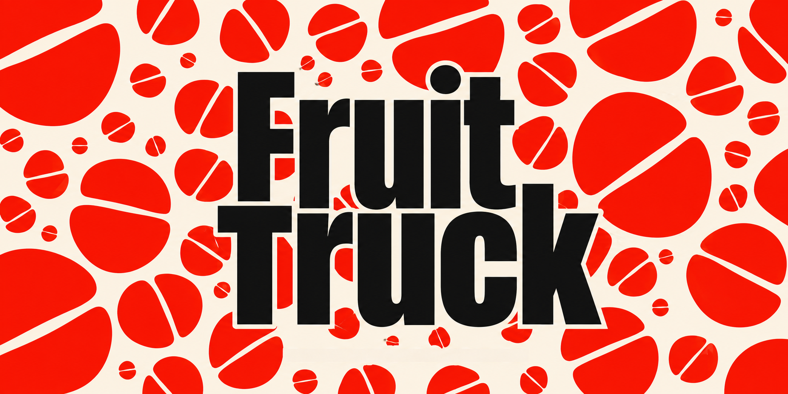
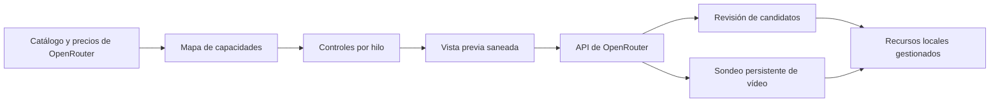

<div align="center">

# Fruit Truck

### Un espacio limpio para generar imágenes y vídeo

Elige un modelo de OpenRouter, consulta solo los controles compatibles y revisa la solicitud JSON exacta antes de generar.

[](#estado-del-proyecto)
[](https://tauri.app/)
[](https://react.dev/)
[](https://www.typescriptlang.org/)
[](https://www.rust-lang.org/)

[English](../../README.md) · [한국어](./README.ko.md) · [简体中文](./README.zh-CN.md) · [日本語](./README.ja.md) · **Español**

<br />



<br />

[¿Por qué Fruit Truck?](#por-qué-fruit-truck) · [Funciones](#funciones) · [Cómo funciona](#cómo-funciona) · [Inicio rápido](#inicio-rápido) · [Seguridad](#seguridad) · [Desarrollo](#desarrollo)

</div>

---

> **Fruit Truck** convierte los metadatos de modelos en vivo de OpenRouter en un espacio de escritorio enfocado. Elige un modelo, crea una solicitud válida, revisa el JSON y genera sin reconstruir el formulario para cada proveedor.

## ¿Por qué Fruit Truck?

Los modelos generativos rara vez coinciden en sus entradas. Uno admite semilla y relación de aspecto; otro necesita fotogramas inicial y final; un tercero acepta varias imágenes de referencia. Fruit Truck lee estas capacidades en tiempo de ejecución y adapta el espacio al modelo elegido.

| Sin Fruit Truck | Con Fruit Truck |
| --- | --- |
| Consultar la documentación de cada modelo | Controles derivados del catálogo de modelos en vivo |
| Adivinar qué campos son válidos | Las opciones no compatibles quedan fuera de la solicitud |
| Crear JSON y URL de datos de imagen a mano | Referencias y parámetros asignados automáticamente |
| Implementar el sondeo de tareas de vídeo | Las tareas activas se restauran y consultan hasta terminar |

## Funciones

- **Primera ejecución guiada** — presenta el flujo y guarda localmente la clave de OpenRouter antes de cargar el espacio de trabajo.
- **Modelos y precios en vivo** — carga directamente desde OpenRouter los catálogos de imagen y vídeo y sus precios publicados.
- **Controles según capacidades** — muestra solo los parámetros compatibles, limita los rangos numéricos y mantiene disponible el enrutamiento avanzado de proveedores.
- **Creación de imagen y vídeo** — admite generación de imágenes y vídeos, edición de imagen con máscara semántica, vídeo a partir de imágenes de referencia o fotogramas inicial/final y mejora de prompts basada en imágenes.
- **Entradas numeradas estables** — copia las cargas en la sesión y permite citarlas de forma consistente como `@1`, `@2`, etc.
- **Hilos de generación independientes** — separa prompts, modelos, opciones, historial y trabajo en segundo plano entre pestañas paralelas de generación de imágenes y vídeos.
- **Inspector de solicitudes** — muestra el JSON exacto antes de enviarlo y omite del visor los cuerpos base64 de gran tamaño.
- **Revisión y continuación de resultados** — permite revisar candidatos y comenzar una edición de imagen, una generación de vídeo o una nueva entrada desde el resultado elegido.
- **Continuidad de tareas y costes** — restaura tareas activas, consulta vídeos hasta completarlos y registra cada intento con su coste estimado o real.
- **Decisiones visuales desde agentes** — empieza en Codex, Claude Code o Hermes; abre Fruit Truck cuando necesites puntos de control de medios, modelos, cargas, montaje o aprobación.
- **Imágenes nativas de Codex** — las sesiones de Codex eligen una vez entre la generación/edición integrada y OpenRouter; Claude Code y Hermes usan OpenRouter.
- **Control compartido** — el panel derecho `Agente / Recursos` reúne estado, acción actual, progreso, pausa/parada y traspaso junto al lienzo de generación.
- **Controles nativos de Mac** — los atajos, menús, navegación por elementos enfocados y comandos limitados al modal agilizan el espacio a ventana completa.
- **Resultados trazables** — la procedencia y la evaluación permanecen disponibles en cada vista previa sin añadir un panel general al espacio principal.
- **Medios locales gestionados** — las cargas viven en `~/.fruit-truck/assets`; los resultados generados y montados, en `~/.fruit-truck/generated`, conservando el formato real y las dimensiones solicitadas.
- **Credenciales locales** — guarda la clave de OpenRouter en los datos locales de la app de escritorio, fuera de vistas previas y registros.

## Cómo funciona



1. En la primera ejecución, Fruit Truck guía la adición de una clave de OpenRouter almacenada solo en el dispositivo.
2. Obtiene catálogos, capacidades, disponibilidad de endpoints y precios publicados de imagen y vídeo.
3. Cada hilo conserva su modo, modelo, prompt, `@entradas` numeradas y opciones.
4. Los ajustes se convierten en una solicitud válida que puedes revisar sin cuerpos de medios incrustados.
5. Las imágenes pasan de inmediato a la revisión de candidatos; las tareas de vídeo persisten y continúan en segundo plano.
6. Los resultados elegidos se guardan como recursos locales y pueden alimentar ediciones de imagen, generación de vídeo guiada por imágenes o solicitudes posteriores.

## Inicio rápido

### Requisitos previos

Estos requisitos solo son necesarios para compilar Fruit Truck desde el código fuente. Quienes instalen el DMG no necesitan Node.js, Rust, Homebrew, FFmpeg ni FFprobe.

| Requisito | Notas |
| --- | --- |
| Node.js | Versión 24 o superior |
| Rust | Cadena de herramientas estable actual |
| Requisitos de Tauri | Dependencias de plataforma de la [guía de configuración de Tauri](https://v2.tauri.app/start/prerequisites/) |
| Clave de OpenRouter | Créala en los [ajustes de OpenRouter](https://openrouter.ai/settings/keys) |

### Ejecutar la aplicación de escritorio

```bash
git clone https://github.com/jbaehova/fruit-truck.git
cd fruit-truck/apps/desktop
npm ci
npm run tauri:dev
```

También puedes ejecutar `./run.sh` desde la raíz del repositorio. Requiere Node.js 24+ y puede seleccionar una instalación compatible aunque una versión antigua aparezca antes en `PATH`. En macOS inicia el proceso de desarrollo con el nombre visible **Fruit Truck**. Para usar la vista de desarrollo solo en navegador, ejecuta `./run.sh --web` o `npm run dev` desde `apps/desktop`.

El renderizado de escritorio desde el árbol de código usa `ffmpeg` y `ffprobe` del `PATH` del desarrollador. Homebrew es una forma opcional de obtenerlos, no un requisito. Los DMG de publicación incluyen sus propios ejecutables para Apple Silicon.

En una instalación nueva, la guía inicial configura OpenRouter antes de abrir el espacio de trabajo. Después puedes cambiar la clave en **Ajustes**; los catálogos se cargarán automáticamente.

### Conectar un agente local

Fruit Truck incluye en el repositorio un servidor MCP stdio independiente y Agent Skills. Hasta que `@fruit-truck/agent-kit` se publique en npm, instala directamente el paquete del repositorio:

```bash
cd agent-kit
npm run build
npm install --global .
fruit-truck-agent-kit install codex --configure
# o: fruit-truck-agent-kit install claude --configure
# o: fruit-truck-agent-kit install hermes --configure
```

El instalador copia [`fruit-truck-agent`](../../agent-kit/skills/fruit-truck-agent/SKILL.md) y [`story-driven-short-form`](../../agent-kit/skills/story-driven-short-form/SKILL.md) al directorio personal de Skills del destino y puede registrar `fruit-truck-mcp`. Consulta la [guía de Agent Kit](../../agent-kit/README.md) para instalación, configuración manual y actualizaciones. El manifiesto de compatibilidad actual admite el escritorio `>=0.6.0 <0.7.0`.

Empieza desde el agente local con una intención aproximada como «Crea un reel de 15 segundos sobre descubrir un perfume en una tienda antigua durante una noche lluviosa». El agente crea la sesión y comprueba Fruit Truck antes de tomar el control. En macOS, la aplicación instalada puede iniciarse en segundo plano, pero nunca solicita el foco. Las ambigüedades narrativas de texto permanecen en el chat del agente; los puntos de control de medios, modelos, cargas, montaje y aprobación esperan de forma duradera en Fruit Truck hasta que los abras.

En una sesión controlada por Codex, la primera tarea de imagen permite elegir entre la generación integrada de Codex y OpenRouter; la elección dura toda la sesión. Las opciones de OpenRouter muestran precios publicados cuando están disponibles. El agente prepara el orden y los rangos finales de los clips, y el usuario los revisa y renderiza en **Crear vídeo final**. Las compilaciones distribuidas para macOS usan FFmpeg/FFprobe LGPL incluidos para entradas MP4, MOV y WebM, y codifican el H.264 final mediante Apple VideoToolbox cuando está disponible.

Las cargas se copian a `~/.fruit-truck/assets`; los medios generados y los recursos antiguos exclusivos de IndexedDB se materializan en el almacenamiento gestionado antes de que el puente los publique. El JSON de sesión y del puente guarda `localPath`, no medios Base64. Las importaciones locales rechazan archivos vacíos y aplican límites de seguridad de 30 MB para imágenes y 700 MB para vídeos.

## Seguridad

En la aplicación Tauri, la clave de OpenRouter se guarda en:

```text
~/.fruit-truck/credentials.json
```

- En macOS y Linux, el directorio se restringe a `0700` y el archivo de credenciales a `0600`.
- La clave aparece oculta en la interfaz y se excluye de las vistas previas y los registros.
- Las llamadas de red pasan por el proceso de Rust, que solo permite las rutas de OpenRouter utilizadas por la aplicación.
- Los vídeos generados compartidos con agentes locales se restringen a `~/.fruit-truck/generated`.

> [!NOTE]
> La vista de desarrollo de Vite en el navegador usa almacenamiento local como alternativa de desarrollo. Usa la aplicación Tauri para gestionar credenciales de escritorio.

## Desarrollo

Ejecuta las comprobaciones desde `apps/desktop`:

```bash
npm run test:unit
npm run check
npm run build
npm run test:e2e
cd src-tauri && cargo test
```

Playwright se ejecuta sin interfaz a 1920×1080 y cubre la primera ejecución en ambos idiomas de la aplicación, el diseño de ventana completa Agente/Recursos, distintivos de decisiones pasivas, revisión visual, montaje y gestión de Agent Skills.

### Empaquetado de medios en macOS

`npm run bundle:mac` compila FFmpeg 8.1.2 desde su archivo fuente verificado para Apple Silicon, valida que solo enlace bibliotecas del sistema macOS y lo incorpora al paquete junto con Fruit Truck Core, Node.js, Agent Kit y sus Skills. Después crea el DMG para Apple Silicon con `src-tauri/tauri.release.conf.json`.

La compilación de FFmpeg desactiva componentes GPL y no libres. El renderizado usa un solo grafo de filtros para recortar, reiniciar marcas de tiempo, escalar conservando la relación de aspecto, rellenar, normalizar a 30 fps y concatenar, seguido de una codificación `h264_videotoolbox`. `allow_sw=1` ofrece la alternativa por software de Apple si el hardware no está disponible. Consulta los [avisos de terceros](../../THIRD_PARTY_NOTICES.md) y la [guía de publicación](../RELEASING.md).

### Estructura del proyecto

```text
fruit-truck/
├── agent-kit/              # Skills de núcleo/flujo y configuración MCP
├── apps/desktop/
│   ├── scripts/            # Servidor MCP para agentes locales
│   ├── src/                 # Espacio React y constructor de solicitudes
│   └── src-tauri/           # Credenciales y proxy de OpenRouter
└── assets/readme/           # Recursos gráficos del README
```

La lógica de solicitudes está en `apps/desktop/src/openrouter.ts`; el límite de seguridad nativo y el proxy de OpenRouter están en `apps/desktop/src-tauri/src/lib.rs`.

## Estado del proyecto

Fruit Truck es actualmente **software beta**. La capa de solicitudes y el flujo de escritorio principal ya funcionan, mientras que el empaquetado, la automatización de versiones y una cobertura más amplia de proveedores siguen evolucionando.

<div align="center">

Creado para quienes buscan flexibilidad de modelos sin ocuparse de cada formato de solicitud.

[Volver arriba](#fruit-truck)

</div>
