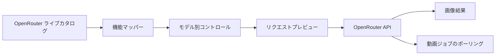

<div align="center">

# Oppa Gen

### 画像・動画生成のための、ひとつの洗練されたワークスペース

OpenRouter のモデルを選ぶと、対応する項目だけを表示し、生成前に実際のリクエスト JSON を確認できます。

[](#プロジェクトの状態)
[](https://tauri.app/)
[](https://react.dev/)
[](https://www.typescriptlang.org/)
[](https://www.rust-lang.org/)

[English](../../README.md) · [한국어](./README.ko.md) · [简体中文](./README.zh-CN.md) · **日本語** · [Español](./README.es.md)

<br />


<br />

[Oppa Gen を選ぶ理由](#oppa-gen-を選ぶ理由) · [機能](#機能) · [仕組み](#仕組み) · [クイックスタート](#クイックスタート) · [セキュリティ](#セキュリティ) · [開発](#開発)

</div>

---

> **Oppa Gen** は、OpenRouter のライブモデルメタデータを集中しやすいデスクトップワークスペースへ変換します。モデルを選び、有効なリクエストを組み立て、JSON を確認してから生成できます。

## Oppa Gen を選ぶ理由

生成モデルの入力仕様は統一されていません。シードやアスペクト比に対応するモデルもあれば、開始・終了フレームを必要とするモデル、複数の参照画像を受け取るモデルもあります。Oppa Gen は実行時に各モデルの機能を読み取り、選択したモデルに合わせてワークスペースを調整します。

| Oppa Gen なし | Oppa Gen あり |
| --- | --- |
| モデルごとにプロバイダーのドキュメントを確認 | ライブモデルカタログから項目を自動構成 |
| 有効なフィールドを推測 | 非対応のオプションはリクエストから除外 |
| JSON や画像データ URL を手作業で作成 | 参照素材とパラメーターを自動マッピング |
| 動画ジョブのポーリングを独自実装 | アクティブなジョブを復元し完了まで自動確認 |

## 機能

- **ライブモデル検出** — OpenRouter から画像・動画モデルのカタログを直接取得します。
- **機能対応コントロール** — 選択中のモデルが対応するパラメーターだけを表示します。
- **画像・動画ワークフロー** — 画像の結果と非同期の動画ジョブをどちらも処理します。
- **柔軟な参照素材** — 対応状況に応じて、アップロードを一般参照・開始フレーム・終了フレームに割り当てます。
- **リクエストインスペクター** — 送信前の JSON を正確に表示し、大きな base64 本文はプレビューから省略します。
- **高度なルーティング** — プロバイダーのルーティングやパススルー設定を任意の JSON で追加できます。
- **ジョブの継続** — 実行中の動画ジョブを記憶し、再起動後もポーリングを再開します。
- **ローカル認証情報保存** — OpenRouter API キーをデスクトップアプリのローカルデータに保存し、リクエストプレビューやログには含めません。

## 仕組み



1. Oppa Gen が画像・動画モデルのライブカタログを取得します。
2. 選択したモデルのメタデータに応じて、入力・参照素材・オプションを決定します。
3. プロンプトと設定をプロバイダーで有効なリクエストに変換します。
4. 生成前に整理されたリクエスト JSON を確認できます。
5. 画像はすぐに表示し、動画ジョブは保存して完了までポーリングします。

## クイックスタート

### 必要なもの

| 要件 | 備考 |
| --- | --- |
| Node.js | バージョン 24 以上 |
| Rust | 現行の安定版ツールチェーン |
| Tauri の前提条件 | [Tauri セットアップガイド](https://v2.tauri.app/start/prerequisites/)にある各プラットフォームの依存関係 |
| OpenRouter API キー | [OpenRouter の設定](https://openrouter.ai/settings/keys)で作成 |

### デスクトップアプリを実行

```bash
git clone https://github.com/jbaehova/oppa-gen.git
cd oppa-gen/apps/desktop
npm install
npm run tauri:dev
```

アプリが開いたら、**Settings** で OpenRouter API キーを追加してください。モデルカタログが自動的に読み込まれます。

## セキュリティ

Tauri デスクトップアプリでは、OpenRouter キーを次の場所に保存します。

```text
~/.oppa-gen/credentials.json
```

- macOS と Linux では、ディレクトリを `0700`、認証情報ファイルを `0600` に制限します。
- キーは画面上でマスクされ、リクエストプレビューとアプリケーションログには含まれません。
- ネットワーク通信は Rust プロセスを経由し、アプリが使用する OpenRouter のパスだけを許可します。
- 生成された動画は、OS のアプリケーションキャッシュディレクトリに保存されます。

> [!NOTE]
> ブラウザー専用の Vite 開発画面では、開発用のフォールバックとしてローカルストレージを使用します。デスクトップの認証情報管理には Tauri アプリを使用してください。

## 開発

`apps/desktop` で各チェックを実行します。

```bash
npm run test:unit
npm run check
npm run build
cd src-tauri && cargo test
```

### プロジェクト構成

```text
oppa-gen/
├── apps/desktop/
│   ├── src/                 # React ワークスペースとリクエストビルダー
│   └── src-tauri/           # 認証情報ストレージと OpenRouter プロキシ
└── assets/readme/           # README 用画像
```

リクエスト生成ロジックは `apps/desktop/src/openrouter.ts`、ネイティブのセキュリティ境界と OpenRouter プロキシは `apps/desktop/src-tauri/src/lib.rs` にあります。

## プロジェクトの状態

Oppa Gen は現在 **ベータ版**です。リクエスト層と主要なデスクトップワークフローは実装済みで、パッケージング、リリース自動化、より広いプロバイダー対応は引き続き改善しています。

<div align="center">

リクエスト形式の煩雑さを減らし、モデルを自由に選びたいクリエイターのために。

[トップへ戻る](#oppa-gen)

</div>
