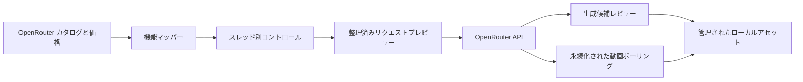

<div align="center">

# Fruit Truck

### 画像・動画生成のための、ひとつの洗練されたワークスペース

OpenRouter のモデルを選ぶと、対応する項目だけを表示し、生成前に実際のリクエスト JSON を確認できます。

[](#プロジェクトの状態)
[](https://tauri.app/)
[](https://react.dev/)
[](https://www.typescriptlang.org/)
[](https://www.rust-lang.org/)

[English](../../README.md) · [한국어](./README.ko.md) · [简体中文](./README.zh-CN.md) · **日本語** · [Español](./README.es.md)

<br />


<br />

[Fruit Truck を選ぶ理由](#fruit-truck-を選ぶ理由) · [機能](#機能) · [仕組み](#仕組み) · [クイックスタート](#クイックスタート) · [セキュリティ](#セキュリティ) · [開発](#開発)

</div>

---

> **Fruit Truck** は、OpenRouter のライブモデルメタデータを集中しやすいデスクトップワークスペースへ変換します。モデルを選び、有効なリクエストを組み立て、JSON を確認してから生成できます。

## Fruit Truck を選ぶ理由

生成モデルの入力仕様は統一されていません。シードやアスペクト比に対応するモデルもあれば、開始・終了フレームを必要とするモデル、複数の参照画像を受け取るモデルもあります。Fruit Truck は実行時に各モデルの機能を読み取り、選択したモデルに合わせてワークスペースを調整します。

| Fruit Truck なし | Fruit Truck あり |
| --- | --- |
| モデルごとにプロバイダーのドキュメントを確認 | ライブモデルカタログから項目を自動構成 |
| 有効なフィールドを推測 | 非対応のオプションはリクエストから除外 |
| JSON や画像データ URL を手作業で作成 | 参照素材とパラメーターを自動マッピング |
| 動画ジョブのポーリングを独自実装 | アクティブなジョブを復元し完了まで自動確認 |

## 機能

- **初回起動ガイド** — ワークフローを紹介し、OpenRouter キーをローカルに保存してからワークスペースを読み込みます。
- **モデルと価格のライブ検出** — OpenRouter から画像・動画カタログと公開価格を直接取得します。
- **機能対応コントロール** — 対応パラメーターだけを表示し、数値範囲を補正しつつ、高度なプロバイダールーティングも利用できます。
- **画像・動画制作** — 画像・動画生成、セマンティックマスク画像編集、参照画像や開始・終了フレームを使う動画生成、画像を参照するプロンプト強化に対応します。
- **安定した番号付き入力** — アップロードをセッションへコピーし、プロンプトから `@1`、`@2` のように一貫して参照できます。
- **独立した生成スレッド** — 並列の画像・動画生成タブごとにプロンプト、モデル、オプション、履歴、バックグラウンド処理を分離します。
- **リクエストインスペクター** — 送信前の JSON を正確に表示し、大きな base64 本文はプレビューから省略します。
- **結果レビューと次の操作** — 生成候補を確認し、選択した結果から画像編集、動画生成、新しい入力のフローを開始できます。
- **ジョブとコストの継続** — 実行中のジョブを復元して動画を完了まで確認し、推定または実コスト付きの試行履歴を追跡します。
- **エージェント起点の視覚的判断** — Codex、Claude Code、Hermes から始め、リッチメディア、モデル、アップロード、組み立て、承認のチェックポイントが必要なときに Fruit Truck を開きます。
- **Codex ネイティブ画像** — Codex セッションでは内蔵画像生成・編集と OpenRouter のどちらかを一度選び、Claude Code と Hermes は OpenRouter を使用します。
- **共有コントロール** — 右側の `エージェント / アセット` パネルで、生成キャンバスの横から状態、現在の処理、進捗、一時停止・停止、引き継ぎを管理します。
- **ネイティブ Mac 操作** — キーボードショートカット、メニュー、フォーカス項目の移動、モーダル内に限定したコマンドで全画面ワークスペースを素早く操作できます。
- **追跡可能な出力** — メインワークスペースにダッシュボードを増やさず、各アセットプレビューで来歴と評価を確認できます。
- **管理されたローカルメディア** — アップロードは `~/.fruit-truck/assets`、生成・組み立て結果は `~/.fruit-truck/generated` に置き、実際の形式と指定した画像寸法を保持します。
- **ローカル認証情報保存** — OpenRouter API キーをデスクトップアプリのローカルデータに保存し、リクエストプレビューやログには含めません。

## 仕組み



1. 初回起動時に、Fruit Truck がデバイス内だけに保存される OpenRouter API キーの追加を案内します。
2. 画像・動画のライブカタログ、機能、エンドポイントの可用性、公開価格を取得します。
3. 各生成スレッドがモード、モデル、プロンプト、番号付きの `@入力`、オプションを個別に保持します。
4. 設定はプロバイダーで有効なリクエストへ変換され、メディア本文を埋め込まずに確認できます。
5. 画像はすぐ候補レビューへ進み、動画ジョブは永続化されてバックグラウンドでポーリングを続けます。
6. 選択した結果はローカルアセットとして保存され、画像編集、画像を参照する動画生成、後続リクエストへ直接渡せます。

## クイックスタート

### 必要なもの

以下はソースから Fruit Truck をビルドする場合の要件です。DMG をインストールする利用者には Node.js、Rust、Homebrew、FFmpeg、FFprobe は必要ありません。

| 要件 | 備考 |
| --- | --- |
| Node.js | バージョン 24 以上 |
| Rust | 現行の安定版ツールチェーン |
| Tauri の前提条件 | [Tauri セットアップガイド](https://v2.tauri.app/start/prerequisites/)にある各プラットフォームの依存関係 |
| OpenRouter API キー | [OpenRouter の設定](https://openrouter.ai/settings/keys)で作成 |

### デスクトップアプリを実行

```bash
git clone https://github.com/jbaehova/fruit-truck.git
cd fruit-truck/apps/desktop
npm ci
npm run tauri:dev
```

リポジトリのルートから `./run.sh` を実行することもできます。Node.js 24 以上が必要で、古い Node が `PATH` の先頭にあっても、インストール済みの Node 24 以上を選択できます。macOS では開発プロセスを **Fruit Truck** という表示名で起動します。ブラウザー専用の開発画面は `./run.sh --web`、または `apps/desktop` で `npm run dev` を実行してください。

ソースツリーのデスクトップレンダリングは、開発者の `PATH` にある `ffmpeg` と `ffprobe` を使用します。Homebrew は任意の導入手段であり、プロジェクト要件ではありません。リリース DMG には Apple Silicon 実行ファイルが同梱されます。

新規インストールでは、初回起動ガイドがワークスペースを開く前に OpenRouter 接続を設定します。以後は **設定** でキーを変更でき、モデルカタログは自動的に読み込まれます。

### ローカルエージェントを接続

Fruit Truck にはスタンドアロンの stdio MCP サーバーと Agent Skills が含まれます。`@fruit-truck/agent-kit` が npm に公開されるまでは、チェックアウトしたパッケージを直接インストールしてください。

```bash
cd agent-kit
npm run build
npm install --global .
fruit-truck-agent-kit install codex --configure
# または: fruit-truck-agent-kit install claude --configure
# または: fruit-truck-agent-kit install hermes --configure
```

インストーラーは [`fruit-truck-agent`](../../agent-kit/skills/fruit-truck-agent/SKILL.md) と [`story-driven-short-form`](../../agent-kit/skills/story-driven-short-form/SKILL.md) を対象ツールの個人 Skill ディレクトリへコピーし、`fruit-truck-mcp` も登録できます。インストール、手動設定、更新コマンドは [Agent Kit ガイド](../../agent-kit/README.md)を参照してください。現在の互換性マニフェストはデスクトップ `>=0.6.0 <0.7.0` をサポートします。

ローカルエージェントで「雨の夜、古い店で香水を見つける 15 秒のリールを作って」のような大まかな意図から始めます。エージェントはセッションを作成し、Fruit Truck の存在を確認してから引き継ぎます。macOS ではインストール済みアプリがバックグラウンドで起動する場合がありますが、前面フォーカスを要求しません。物語上のテキストの曖昧さはエージェントチャットで扱い、メディア、モデル、アップロード、組み立て、承認のチェックポイントはユーザーが開くまで Fruit Truck 内で永続的に待機します。

Codex が制御するセッションでは、最初の画像タスクで Codex 内蔵画像生成と OpenRouter のどちらかを選び、その選択がセッション中継続します。OpenRouter のモデル選択には、利用可能なら公開価格も表示されます。エージェントが最終クリップの順序と範囲を準備したら、ユーザーが **最終動画を作成** で確認してレンダリングします。配布用 macOS ビルドは、MP4、MOV、WebM 入力に同梱の LGPL FFmpeg/FFprobe を使い、可能な場合は Apple VideoToolbox のハードウェア経路で最終 H.264 をエンコードします。

アップロードは `~/.fruit-truck/assets` にコピーされます。生成メディアと旧来の IndexedDB 専用アセットは、ブリッジが公開する前に管理ストレージへ実体化されます。セッションとブリッジ JSON は Base64 メディアではなく `localPath` メタデータを保存します。ローカルインポートは空ファイルを拒否し、画像 30 MB、動画 700 MB の安全上限を適用します。

## セキュリティ

Tauri デスクトップアプリでは、OpenRouter キーを次の場所に保存します。

```text
~/.fruit-truck/credentials.json
```

- macOS と Linux では、ディレクトリを `0700`、認証情報ファイルを `0600` に制限します。
- キーは画面上でマスクされ、リクエストプレビューとアプリケーションログには含まれません。
- ネットワーク通信は Rust プロセスを経由し、アプリが使用する OpenRouter のパスだけを許可します。
- ローカルエージェントと共有する生成動画は `~/.fruit-truck/generated` 内に制限されます。

> [!NOTE]
> ブラウザー専用の Vite 開発画面では、開発用のフォールバックとしてローカルストレージを使用します。デスクトップの認証情報管理には Tauri アプリを使用してください。

## 開発

`apps/desktop` で各チェックを実行します。

```bash
npm run test:unit
npm run check
npm run build
npm run test:e2e
cd src-tauri && cargo test
```

Playwright は 1920×1080 の全画面を基準にヘッドレスで実行され、アプリの両言語による初回起動、エージェント/アセットのレイアウト、受動的な判断バッジ、視覚レビュー、組み立て、Agent Skill 管理を対象にします。

### macOS メディアパッケージング

`npm run bundle:mac` は検証済みソースアーカイブから FFmpeg 8.1.2 を Apple Silicon 向けにビルドし、macOS システムライブラリだけへリンクすることを確認して、Fruit Truck Core、Node.js、Agent Kit、Skills と共にアプリバンドルへ配置します。続いて `src-tauri/tauri.release.conf.json` を使って Apple Silicon DMG をビルドします。

FFmpeg ビルドでは GPL と非自由コンポーネントを無効化します。レンダリングはトリム、タイムスタンプのリセット、アスペクト比を保つスケール、パディング、30 fps 正規化、連結を単一フィルターグラフで行い、その後 `h264_videotoolbox` で一度だけエンコードします。ハードウェアエンコードが利用できなければ、`allow_sw=1` が Apple のソフトウェアフォールバックを提供します。[サードパーティ通知](../../THIRD_PARTY_NOTICES.md)と[リリースガイド](../RELEASING.md)を参照してください。

### プロジェクト構成

```text
fruit-truck/
├── agent-kit/              # コア/ワークフロー Skills と MCP 設定
├── apps/desktop/
│   ├── scripts/            # ローカルエージェント MCP サーバー
│   ├── src/                 # React ワークスペースとリクエストビルダー
│   └── src-tauri/           # 認証情報ストレージと OpenRouter プロキシ
└── assets/readme/           # README 用画像
```

リクエスト生成ロジックは `apps/desktop/src/openrouter.ts`、ネイティブのセキュリティ境界と OpenRouter プロキシは `apps/desktop/src-tauri/src/lib.rs` にあります。

## プロジェクトの状態

Fruit Truck は現在 **ベータ版**です。リクエスト層と主要なデスクトップワークフローは実装済みで、パッケージング、リリース自動化、より広いプロバイダー対応は引き続き改善しています。

<div align="center">

リクエスト形式の煩雑さを減らし、モデルを自由に選びたいクリエイターのために。

[トップへ戻る](#fruit-truck)

</div>
