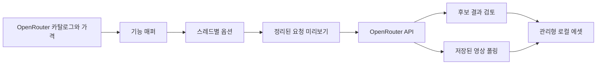

<div align="center">

# Fruit Truck

### 이미지와 영상 생성을 위한 하나의 깔끔한 작업 공간

OpenRouter 모델을 고르면 지원되는 옵션만 보여 주고, 생성 전에 실제 요청 JSON을 확인할 수 있습니다.

[](#프로젝트-상태)
[](https://tauri.app/)
[](https://react.dev/)
[](https://www.typescriptlang.org/)
[](https://www.rust-lang.org/)

[English](../../README.md) · **한국어** · [简体中文](./README.zh-CN.md) · [日本語](./README.ja.md) · [Español](./README.es.md)

<br />


<br />

[왜 Fruit Truck인가요?](#왜-fruit-truck인가요) · [주요 기능](#주요-기능) · [작동 방식](#작동-방식) · [빠른 시작](#빠른-시작) · [보안](#보안) · [개발](#개발)

</div>

---

> **Fruit Truck**는 OpenRouter의 실시간 모델 메타데이터를 집중도 높은 데스크톱 작업 공간으로 바꿉니다. 모델을 선택하고, 올바른 요청을 구성하고, JSON을 미리 확인한 뒤 바로 생성하세요.

## 왜 Fruit Truck인가요?

생성 모델마다 입력 형식은 제각각입니다. 어떤 모델은 시드와 화면비를 지원하고, 다른 모델은 시작·종료 프레임을 요구하며, 또 다른 모델은 여러 참조 이미지를 받습니다. Fruit Truck은 실행 중에 이런 기능 정보를 읽어 선택한 모델에 맞게 작업 공간을 자동으로 조정합니다.

| Fruit Truck 없이 | Fruit Truck과 함께 |
| --- | --- |
| 모델마다 제공자 문서를 다시 확인 | 실시간 모델 카탈로그에서 옵션 자동 구성 |
| 어떤 필드가 유효한지 추측 | 미지원 옵션은 요청에서 자동 제외 |
| JSON과 이미지 데이터 URL을 직접 작성 | 참조 이미지와 매개변수를 자동 매핑 |
| 영상 작업 폴링을 별도로 구현 | 활성 작업을 복원하고 완료까지 자동 확인 |

## 주요 기능

- **안내형 첫 실행** — 작업 흐름을 소개하고 OpenRouter 키를 로컬에 저장한 뒤 작업 공간을 엽니다.
- **실시간 모델·가격 탐색** — OpenRouter에서 이미지·영상 카탈로그와 공개 가격 정보를 직접 불러옵니다.
- **기능 기반 옵션** — 지원되는 매개변수만 표시하고 숫자 범위를 보정하며, 고급 제공자 라우팅도 사용할 수 있습니다.
- **이미지·영상 제작** — 이미지·영상 생성, 시맨틱 마스크 이미지 편집, 이미지 참조·시작/끝 프레임 기반 영상 생성, 이미지 기반 프롬프트 향상을 지원합니다.
- **고정 번호 입력** — 업로드를 세션에 복사하고 프롬프트에서 `@1`, `@2`처럼 일관되게 참조할 수 있습니다.
- **독립적인 생성 스레드** — 병렬 이미지·영상 생성 탭마다 프롬프트, 모델, 옵션, 기록, 백그라운드 작업을 분리합니다.
- **요청 검사기** — 전송될 JSON을 정확히 보여 주되, 큰 base64 본문은 미리보기에서 생략합니다.
- **결과 검토와 후속 작업** — 생성 후보를 검토하고 선택한 결과에서 이미지 편집, 영상 생성, 새 입력 흐름을 바로 시작합니다.
- **작업·비용 연속성** — 활성 작업을 복원하고 영상 완료까지 확인하며, 예상·실제 비용이 포함된 시도 기록을 추적합니다.
- **에이전트 우선·시각적 결정** — Codex, Claude Code 또는 Hermes에서 시작하고, 리치 미디어·모델·업로드·조립·승인 체크포인트가 필요할 때 Fruit Truck을 엽니다.
- **Codex 네이티브 이미지** — Codex 세션은 내장 이미지 생성·편집과 OpenRouter 중 한 번 선택하며, Claude Code와 Hermes는 OpenRouter를 사용합니다.
- **공유 제어** — 오른쪽 `에이전트 / 에셋` 패널에서 상태, 현재 작업, 진행률, 일시정지·중지, 인계 제어를 생성 캔버스 옆에서 관리합니다.
- **네이티브 Mac 조작** — 키보드 단축키, 메뉴, 포커스 항목 탐색, 모달 범위 명령으로 전체 창 작업 공간을 빠르게 조작합니다.
- **추적 가능한 결과** — 메인 작업 공간에 별도 대시보드를 추가하지 않고 각 에셋 미리보기에서 출처와 평가를 확인합니다.
- **관리형 로컬 미디어** — 업로드는 `~/.fruit-truck/assets`, 생성·조립 결과는 `~/.fruit-truck/generated`에 저장하며 실제 미디어 형식과 요청한 이미지 크기를 보존합니다.
- **로컬 자격 증명 저장** — OpenRouter API 키를 요청 미리보기와 로그에서 분리해 데스크톱 앱의 로컬 데이터에 보관합니다.

## 작동 방식



1. 첫 실행 시 Fruit Truck이 기기에만 저장되는 OpenRouter API 키 추가 과정을 안내합니다.
2. 실시간 이미지·영상 카탈로그, 기능, 엔드포인트 상태, 공개 가격 정보를 가져옵니다.
3. 생성 스레드마다 모드, 모델, 프롬프트, 번호가 붙은 `@입력`, 옵션을 따로 유지합니다.
4. 설정을 제공자에 유효한 요청으로 변환하며, 미디어 본문 없이 내용을 미리 확인할 수 있습니다.
5. 이미지는 즉시 후보 검토로 이동하고, 영상 작업은 저장되어 백그라운드에서 계속 확인됩니다.
6. 선택한 결과는 로컬 에셋으로 저장되어 이미지 편집, 이미지 기반 영상 생성, 이후 요청에 바로 사용할 수 있습니다.

## 빠른 시작

### 준비 사항

다음 요구 사항은 소스에서 Fruit Truck을 빌드할 때만 필요합니다. DMG를 설치하는 사용자는 Node.js, Rust, Homebrew, FFmpeg 또는 FFprobe가 필요하지 않습니다.

| 요구 사항 | 설명 |
| --- | --- |
| Node.js | 24 이상 |
| Rust | 최신 안정 도구 모음 |
| Tauri 사전 요구 사항 | [Tauri 설정 가이드](https://v2.tauri.app/start/prerequisites/)의 플랫폼별 의존성 |
| OpenRouter API 키 | [OpenRouter 설정](https://openrouter.ai/settings/keys)에서 생성 |

### 데스크톱 앱 실행

```bash
git clone https://github.com/jbaehova/fruit-truck.git
cd fruit-truck/apps/desktop
npm ci
npm run tauri:dev
```

저장소 루트에서 `./run.sh`를 실행해도 됩니다. Node.js 24 이상이 필요하며, `PATH` 앞쪽에 더 오래된 Node가 있어도 설치된 Node 24 이상을 선택할 수 있습니다. macOS에서는 개발 프로세스를 **Fruit Truck**이라는 이름으로 실행합니다. 브라우저 전용 개발 화면은 `./run.sh --web` 또는 `apps/desktop`의 `npm run dev`로 실행하세요.

소스 트리 데스크톱 렌더링은 개발자 `PATH`의 `ffmpeg`와 `ffprobe`를 사용합니다. Homebrew는 이를 설치하는 한 가지 방법일 뿐 필수 요구 사항이 아닙니다. 릴리스 DMG에는 Apple Silicon 실행 파일이 포함됩니다.

새로 설치한 앱에서는 첫 실행 안내가 작업 공간을 열기 전에 OpenRouter 연결을 처리합니다. 이후에는 **설정**에서 키를 변경할 수 있으며 모델 카탈로그는 자동으로 로드됩니다.

### 로컬 에이전트 연결

macOS 앱에는 Codex, Claude Code, Hermes 연결에 필요한 구성 요소가 모두 포함됩니다. DMG를 설치한 다음 Fruit Truck을 한 번 실행하면 첫 실행 안내가 Mac에 설치된 에이전트를 감지하고 각각에 **연결** 버튼을 표시합니다. 같은 기능은 언제든 **설정 → 에이전트 연결**에서 사용할 수 있습니다.

앱 사용자는 Node.js나 npm 패키지를 따로 설치하거나 MCP 명령을 실행하거나 스킬·플러그인을 직접 복사할 필요가 없습니다. **연결**을 누르면 Fruit Truck이 로컬 연결 도구와 워크플로를 설치하고 이후 업데이트도 처리합니다. 완료 안내가 나오면 연결한 에이전트를 재시작한 뒤 Fruit Truck으로 작업을 요청하면 됩니다.

저장소의 [Agent Kit 가이드](../../agent-kit/README.md)는 소스 트리 개발과 수동 통합 테스트용으로 계속 제공됩니다. 현재 패키지 호환성 매니페스트는 데스크톱 `>=0.6.0 <0.7.0`을 지원합니다.

로컬 에이전트에서 “비 오는 밤 오래된 가게에서 향수를 발견하는 15초 릴을 만들어 줘” 같은 대략적인 의도로 시작하세요. 에이전트는 세션을 만들고 Fruit Truck 존재를 확인한 뒤 인계합니다. macOS에서 설치된 앱은 백그라운드로 실행될 수 있지만 전면 포커스를 요구하지 않습니다. 이야기의 텍스트 모호성은 에이전트 채팅에서 해결하고, 미디어·모델·업로드·조립·승인 체크포인트는 사용자가 열 때까지 Fruit Truck에서 안전하게 대기합니다.

Codex가 제어하는 세션의 첫 이미지 작업에서는 Codex 내장 이미지 생성과 OpenRouter 중 하나를 고르며, 이 선택은 세션 동안 유지됩니다. OpenRouter 모델 선택에는 가능한 경우 공개 가격이 표시됩니다. 에이전트가 최종 클립 순서와 구간을 준비하면 사용자가 **최종 영상 만들기**에서 검토하고 렌더링합니다. 배포용 macOS 빌드는 MP4, MOV, WebM 입력에 번들된 LGPL FFmpeg/FFprobe를 사용하고, 가능한 경우 Apple VideoToolbox 하드웨어 경로로 최종 H.264 파일을 인코딩합니다.

업로드는 `~/.fruit-truck/assets`에 복사됩니다. 생성 미디어와 기존 IndexedDB 전용 에셋은 브리지가 게시하기 전에 관리형 저장소로 옮겨집니다. 세션과 브리지 JSON에는 Base64 미디어 대신 `localPath` 메타데이터가 저장됩니다. 로컬 가져오기는 빈 파일을 거부하고 이미지 30 MB, 영상 700 MB의 안전 제한을 적용합니다.

## 보안

Tauri 데스크톱 앱에서 OpenRouter 키는 다음 위치에 저장됩니다.

```text
~/.fruit-truck/credentials.json
```

- macOS와 Linux에서는 디렉터리 권한을 `0700`, 자격 증명 파일 권한을 `0600`으로 제한합니다.
- 키는 인터페이스에서 마스킹되며 요청 미리보기와 애플리케이션 로그에 포함되지 않습니다.
- 네트워크 요청은 Rust 프로세스를 거치며, 앱이 사용하는 OpenRouter 경로만 허용합니다.
- 로컬 에이전트와 공유하는 생성 영상 경로는 `~/.fruit-truck/generated`로 제한합니다.

> [!NOTE]
> 브라우저 전용 Vite 개발 화면에서는 개발용 대체 방식으로 로컬 스토리지를 사용합니다. 데스크톱 자격 증명 처리는 Tauri 앱을 사용하세요.

## 개발

`apps/desktop`에서 검사를 실행합니다.

```bash
npm run test:unit
npm run check
npm run build
npm run test:e2e
cd src-tauri && cargo test
```

Playwright는 1920×1080 전체 창을 기준으로 headless 실행되며, 앱의 두 언어로 된 첫 실행 안내, 에이전트/에셋 레이아웃, 수동 결정 배지, 시각 검토, 조립, 에이전트 스킬 관리를 다룹니다.

### macOS 미디어 패키징

`npm run bundle:mac`은 검증된 소스 아카이브에서 FFmpeg 8.1.2를 Apple Silicon용으로 빌드하고, macOS 시스템 라이브러리에만 링크되는지 확인한 뒤 Fruit Truck Core, Node.js, Agent Kit, Skills와 함께 앱 번들에 넣습니다. 이어서 `src-tauri/tauri.release.conf.json`으로 Apple Silicon DMG를 빌드합니다.

FFmpeg 빌드에서는 GPL 및 비자유 구성 요소를 비활성화합니다. 렌더링은 트림, 타임스탬프 초기화, 화면비 맞춤 크기 조절, 패딩, 30fps 정규화, 이어 붙이기를 하나의 필터 그래프로 처리한 뒤 `h264_videotoolbox`로 한 번 인코딩합니다. 하드웨어 인코딩을 사용할 수 없으면 `allow_sw=1`이 Apple 소프트웨어 폴백을 제공합니다. [서드파티 고지](../../THIRD_PARTY_NOTICES.md)와 [릴리스 가이드](../RELEASING.md)를 참고하세요.

### 프로젝트 구조

```text
fruit-truck/
├── agent-kit/              # 코어·워크플로 스킬과 MCP 설정
├── apps/desktop/
│   ├── scripts/            # 로컬 에이전트 MCP 서버
│   ├── src/                 # React 작업 공간 및 요청 빌더
│   └── src-tauri/           # 자격 증명 저장소 및 OpenRouter 프록시
└── assets/readme/           # README 이미지
```

요청 생성 로직은 `apps/desktop/src/openrouter.ts`에, 네이티브 보안 경계와 OpenRouter 프록시는 `apps/desktop/src-tauri/src/lib.rs`에 있습니다.

## 프로젝트 상태

Fruit Truck은 현재 **베타 소프트웨어**입니다. 요청 계층과 핵심 데스크톱 흐름은 구현되어 있으며, 패키징·릴리스 자동화·더 넓은 제공자 지원은 계속 발전하고 있습니다.

<div align="center">

요청 형식의 번거로움 없이 다양한 모델을 쓰고 싶은 크리에이터를 위해 만들었습니다.

[맨 위로](#fruit-truck)

</div>
