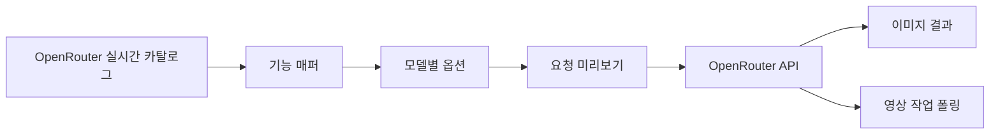

<div align="center">

# OpenGen UI

### 이미지와 영상 생성을 위한 하나의 깔끔한 작업 공간

OpenRouter 모델을 고르면 지원되는 옵션만 보여 주고, 생성 전에 실제 요청 JSON을 확인할 수 있습니다.

[](#프로젝트-상태)
[](https://tauri.app/)
[](https://react.dev/)
[](https://www.typescriptlang.org/)
[](https://www.rust-lang.org/)

[English](../../README.md) · **한국어** · [简体中文](./README.zh-CN.md) · [日本語](./README.ja.md) · [Español](./README.es.md)

<br />


<br />

[왜 OpenGen UI인가요?](#왜-open-gen-ui인가요) · [주요 기능](#주요-기능) · [작동 방식](#작동-방식) · [빠른 시작](#빠른-시작) · [보안](#보안) · [개발](#개발)

</div>

---

> **OpenGen UI**는 OpenRouter의 실시간 모델 메타데이터를 집중도 높은 데스크톱 작업 공간으로 바꿉니다. 모델을 선택하고, 올바른 요청을 구성하고, JSON을 미리 확인한 뒤 바로 생성하세요.

## 왜 OpenGen UI인가요?

생성 모델마다 입력 형식은 제각각입니다. 어떤 모델은 시드와 화면비를 지원하고, 다른 모델은 시작·종료 프레임을 요구하며, 또 다른 모델은 여러 참조 이미지를 받습니다. OpenGen UI는 실행 중에 이런 기능 정보를 읽어 선택한 모델에 맞게 작업 공간을 자동으로 조정합니다.

| OpenGen UI 없이 | OpenGen UI와 함께 |
| --- | --- |
| 모델마다 제공자 문서를 다시 확인 | 실시간 모델 카탈로그에서 옵션 자동 구성 |
| 어떤 필드가 유효한지 추측 | 미지원 옵션은 요청에서 자동 제외 |
| JSON과 이미지 데이터 URL을 직접 작성 | 참조 이미지와 매개변수를 자동 매핑 |
| 영상 작업 폴링을 별도로 구현 | 활성 작업을 복원하고 완료까지 자동 확인 |

## 주요 기능

- **실시간 모델 탐색** — OpenRouter에서 이미지·영상 모델 목록을 직접 불러옵니다.
- **기능 기반 옵션** — 선택한 모델이 지원하는 매개변수만 화면에 표시합니다.
- **이미지·영상 워크플로** — 즉시 반환되는 이미지와 비동기 영상 작업을 모두 처리합니다.
- **유연한 참조 파일** — 지원 여부에 따라 업로드 파일을 일반 참조, 시작 프레임, 종료 프레임으로 매핑합니다.
- **요청 검사기** — 전송될 JSON을 정확히 보여 주되, 큰 base64 본문은 미리보기에서 생략합니다.
- **고급 라우팅** — 선택적인 제공자 라우팅 및 패스스루 설정을 JSON으로 입력할 수 있습니다.
- **작업 연속성** — 진행 중인 영상 작업을 기억하고 앱 재시작 후 폴링을 이어갑니다.
- **로컬 자격 증명 저장** — OpenRouter API 키를 요청 미리보기와 로그에서 분리해 데스크톱 앱의 로컬 데이터에 보관합니다.

## 작동 방식



1. OpenGen UI가 실시간 이미지·영상 모델 카탈로그를 가져옵니다.
2. 선택한 모델의 메타데이터에 따라 입력, 참조 파일, 옵션이 결정됩니다.
3. 프롬프트와 설정을 제공자에 유효한 요청으로 변환합니다.
4. 생성 전에 정리된 요청 JSON을 확인할 수 있습니다.
5. 이미지는 즉시 표시하고, 영상 작업은 저장한 뒤 완료될 때까지 확인합니다.

## 빠른 시작

### 준비 사항

| 요구 사항 | 설명 |
| --- | --- |
| Node.js | 24 이상 |
| Rust | 최신 안정 도구 모음 |
| Tauri 사전 요구 사항 | [Tauri 설정 가이드](https://v2.tauri.app/start/prerequisites/)의 플랫폼별 의존성 |
| OpenRouter API 키 | [OpenRouter 설정](https://openrouter.ai/settings/keys)에서 생성 |

### 데스크톱 앱 실행

```bash
git clone https://github.com/jbaehova/open-gen-ui.git
cd open-gen-ui/apps/desktop
npm ci
npm run tauri:dev
```

브라우저 전용 개발 화면을 사용하려면 `apps/desktop`에서 `npm run dev`를 실행하세요.

앱이 열리면 **Settings**에서 OpenRouter API 키를 추가하세요. 모델 카탈로그가 자동으로 로드됩니다.

## 보안

Tauri 데스크톱 앱에서 OpenRouter 키는 다음 위치에 저장됩니다.

```text
~/.open-gen-ui/credentials.json
```

- macOS와 Linux에서는 디렉터리 권한을 `0700`, 자격 증명 파일 권한을 `0600`으로 제한합니다.
- 키는 인터페이스에서 마스킹되며 요청 미리보기와 애플리케이션 로그에 포함되지 않습니다.
- 네트워크 요청은 Rust 프로세스를 거치며, 앱이 사용하는 OpenRouter 경로만 허용합니다.
- 생성된 영상은 운영체제의 애플리케이션 캐시 디렉터리에 저장됩니다.

> [!NOTE]
> 브라우저 전용 Vite 개발 화면에서는 개발용 대체 방식으로 로컬 스토리지를 사용합니다. 데스크톱 자격 증명 처리는 Tauri 앱을 사용하세요.

## 개발

`apps/desktop`에서 검사를 실행합니다.

```bash
npm run test:unit
npm run check
npm run build
cd src-tauri && cargo test
```

### 프로젝트 구조

```text
open-gen-ui/
├── apps/desktop/
│   ├── src/                 # React 작업 공간 및 요청 빌더
│   └── src-tauri/           # 자격 증명 저장소 및 OpenRouter 프록시
└── assets/readme/           # README 이미지
```

요청 생성 로직은 `apps/desktop/src/openrouter.ts`에, 네이티브 보안 경계와 OpenRouter 프록시는 `apps/desktop/src-tauri/src/lib.rs`에 있습니다.

## 프로젝트 상태

OpenGen UI는 현재 **베타 소프트웨어**입니다. 요청 계층과 핵심 데스크톱 흐름은 구현되어 있으며, 패키징·릴리스 자동화·더 넓은 제공자 지원은 계속 발전하고 있습니다.

<div align="center">

요청 형식의 번거로움 없이 다양한 모델을 쓰고 싶은 크리에이터를 위해 만들었습니다.

[맨 위로](#open-gen-ui)

</div>
