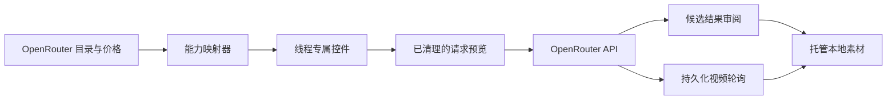

<div align="center">

# Fruit Truck

### 一个简洁的图像与视频生成工作区

选择 OpenRouter 模型，只显示它支持的控件，并在生成前检查实际发送的请求 JSON。

[](#项目状态)
[](https://tauri.app/)
[](https://react.dev/)
[](https://www.typescriptlang.org/)
[](https://www.rust-lang.org/)

[English](../../README.md) · [한국어](./README.ko.md) · **简体中文** · [日本語](./README.ja.md) · [Español](./README.es.md)

<br />


<br />

[为什么选择 Fruit Truck？](#为什么选择-fruit-truck) · [功能](#功能) · [工作原理](#工作原理) · [快速开始](#快速开始) · [安全性](#安全性) · [开发](#开发)

</div>

---

> **Fruit Truck** 将 OpenRouter 的实时模型元数据转化为专注的桌面工作区。选择模型、构建有效请求、预览 JSON，然后直接生成内容。

## 为什么选择 Fruit Truck？

不同生成模型的输入方式往往并不一致：有些支持种子和宽高比，有些需要首帧与尾帧，还有些可以接收多张参考图。Fruit Truck 会在运行时读取这些能力，并根据所选模型自动调整工作区。

| 不使用 Fruit Truck | 使用 Fruit Truck |
| --- | --- |
| 为每个模型反复查阅提供商文档 | 根据实时模型目录自动生成控件 |
| 猜测哪些字段有效 | 不支持的选项不会进入请求 |
| 手动编写 JSON 和图像数据 URL | 自动映射参考图与参数 |
| 自行实现视频任务轮询 | 恢复活动任务并持续轮询至完成 |

## 功能

- **引导式首次启动** — 介绍工作流程，在本机保存 OpenRouter 密钥后再加载工作区。
- **实时发现模型与价格** — 直接从 OpenRouter 加载图像、视频目录及已公布的价格。
- **能力感知控件** — 仅显示受支持的参数，自动限制数值范围，并保留高级提供商路由设置。
- **图像与视频创作** — 支持图像与视频生成、语义蒙版图像编辑、基于参考图或首尾帧的视频生成，以及基于图像的提示词增强。
- **稳定的编号输入** — 将上传素材复制到会话，并可在提示词中始终使用 `@1`、`@2` 等编号引用。
- **独立生成线程** — 在并行的图像与视频生成标签页间隔离提示词、模型、选项、历史和后台任务。
- **请求检查器** — 在发送前展示准确的 JSON，并在预览中省略体积较大的 base64 正文。
- **结果审阅与后续操作** — 审阅生成候选，并从选中结果直接开始图像编辑、视频生成或作为新输入使用。
- **任务与费用连续性** — 恢复活动任务、持续轮询视频，并通过预计或实际费用跟踪每次尝试。
- **以代理为起点的可视化决策** — 从 Codex、Claude Code 或 Hermes 开始；需要富媒体、模型、上传、组装或批准检查点时再打开 Fruit Truck。
- **Codex 原生图像** — Codex 会话可在内置图像生成/编辑与 OpenRouter 之间选择一次；Claude Code 和 Hermes 始终使用 OpenRouter。
- **共享控制** — 右侧 `代理 / 素材` 面板在生成画布旁显示状态、当前操作、进度、暂停/停止及交接控制。
- **原生 Mac 操作** — 通过键盘快捷键、菜单、焦点项导航和限定在模态框内的命令，高效操作全窗口工作区。
- **可追溯输出** — 无需在主工作区增加仪表板，即可在每个素材预览中查看来源与评估。
- **托管本地媒体** — 上传内容保存在 `~/.fruit-truck/assets`，生成及组装结果保存在 `~/.fruit-truck/generated`，并保留实际媒体格式和请求的图像尺寸。
- **本地凭据存储** — 将 OpenRouter API 密钥保存在桌面应用的本地数据中，不写入请求预览或日志。

## 工作原理



1. 首次启动时，Fruit Truck 会引导你添加仅保存在本机的 OpenRouter API 密钥。
2. 它会获取实时图像与视频目录、模型能力、端点可用性及已公布的价格。
3. 每个生成线程分别保存模式、模型、提示词、编号 `@输入`和选项。
4. 设置会转换为提供商可接受的请求，并可在不嵌入媒体正文的情况下预览。
5. 图像会立即进入候选审阅；视频任务会持久保存并在后台继续轮询。
6. 选中结果会保存为本地素材，可直接用于图像编辑、图像引导的视频生成或后续请求。

## 快速开始

### 前置条件

以下要求仅适用于从源代码构建 Fruit Truck。安装 DMG 的用户不需要 Node.js、Rust、Homebrew、FFmpeg 或 FFprobe。

| 要求 | 说明 |
| --- | --- |
| Node.js | 24 或更高版本 |
| Rust | 当前稳定工具链 |
| Tauri 前置条件 | [Tauri 配置指南](https://v2.tauri.app/start/prerequisites/)中的平台依赖 |
| OpenRouter API 密钥 | 在 [OpenRouter 设置](https://openrouter.ai/settings/keys)中创建 |

### 运行桌面应用

```bash
git clone https://github.com/jbaehova/fruit-truck.git
cd fruit-truck/apps/desktop
npm ci
npm run tauri:dev
```

也可以从仓库根目录运行 `./run.sh`。它需要 Node.js 24+；即使 `PATH` 中较旧的 Node 排在前面，也能选择已安装的 Node 24+。在 macOS 上，开发进程会以 **Fruit Truck** 的可见名称启动。若使用仅浏览器的开发视图，请运行 `./run.sh --web`，或在 `apps/desktop` 中运行 `npm run dev`。

源代码目录中的桌面渲染会使用开发者 `PATH` 里的 `ffmpeg` 和 `ffprobe`。Homebrew 只是可选安装方式，并非项目要求。发布版 DMG 会捆绑自己的 Universal 可执行文件。

全新安装时，首次启动向导会在打开工作区前完成 OpenRouter 连接。之后可在 **设置** 中更换密钥，模型目录会自动加载。

### 连接本地代理

Fruit Truck 仓库中包含独立的 stdio MCP 服务器和 Agent Skills。在 `@fruit-truck/agent-kit` 发布到 npm 前，请直接安装已检出的本地包：

```bash
cd agent-kit
npm run build
npm install --global .
fruit-truck-agent-kit install codex --configure
# 或：fruit-truck-agent-kit install claude --configure
# 或：fruit-truck-agent-kit install hermes --configure
```

安装程序会将 [`fruit-truck-agent`](../../agent-kit/skills/fruit-truck-agent/SKILL.md) 和 [`story-driven-short-form`](../../agent-kit/skills/story-driven-short-form/SKILL.md) 复制到目标工具的个人 Skill 目录，也可以注册 `fruit-truck-mcp`。安装、手动配置和更新命令请参阅 [Agent Kit 指南](../../agent-kit/README.md)。当前兼容性清单支持桌面版本 `>=0.6.0 <0.7.0`。

可以在本地代理中用类似“制作一个 15 秒短片，讲述雨夜在老店中发现一瓶香水”的粗略意图开始。代理会创建会话，并在接管前确认 Fruit Truck 是否存在。在 macOS 上，已安装的应用可能在后台启动，但不会请求前台焦点。故事文本中的歧义保留在代理聊天中处理；媒体、模型、上传、组装和批准检查点会在 Fruit Truck 中持久等待，直到你主动打开。

在 Codex 控制的会话中，第一个图像任务会让你在 Codex 内置图像生成与 OpenRouter 之间选择，且选择在整个会话内有效。OpenRouter 模型选项会在可用时显示公开价格。代理准备最终片段顺序和区间后，用户可在 **制作最终视频** 中审阅并渲染。分发版 macOS 构建使用捆绑的 LGPL FFmpeg/FFprobe 读取 MP4、MOV 与 WebM，并在可用时通过 Apple VideoToolbox 硬件路径编码最终 H.264 文件。

上传内容会复制到 `~/.fruit-truck/assets`；生成媒体和旧版仅存于 IndexedDB 的素材会在桥接发布前写入托管存储。会话和桥接 JSON 仅保存 `localPath` 元数据，不保存 Base64 媒体。导入本地文件时会拒绝空文件，并对图像和视频分别实施 30 MB 与 700 MB 的安全上限。

## 安全性

在 Tauri 桌面应用中，OpenRouter 密钥存储于：

```text
~/.fruit-truck/credentials.json
```

- 在 macOS 和 Linux 上，目录权限限制为 `0700`，凭据文件权限限制为 `0600`。
- 密钥会在界面中遮盖，并从请求预览和应用日志中排除。
- 网络调用通过 Rust 进程代理，并且只允许应用使用的 OpenRouter 路径。
- 与本地代理共享的生成视频仅允许位于 `~/.fruit-truck/generated`。

> [!NOTE]
> 仅浏览器运行的 Vite 开发页面会使用本地存储作为开发备用方案。桌面凭据处理请使用 Tauri 应用。

## 开发

在 `apps/desktop` 目录中运行检查：

```bash
npm run test:unit
npm run check
npm run build
npm run test:e2e
cd src-tauri && cargo test
```

Playwright 以 1920×1080 全窗口为基准无头运行，覆盖两种应用语言的首次启动、代理/素材布局、被动决策徽标、可视化审阅、组装以及 Agent Skill 管理。

### macOS 媒体打包

`npm run bundle:mac:universal` 从已验证的源代码归档分别为 Apple Silicon 和 Intel 构建 FFmpeg 8.1.2，合并两个架构切片，验证其仅链接 macOS 系统库，再放入应用包中。随后使用 `src-tauri/tauri.release.conf.json` 构建 Universal DMG。

FFmpeg 构建会禁用 GPL 和非自由组件。渲染使用一个滤镜图完成裁剪、时间戳重置、保持宽高比缩放、填充、30 fps 标准化与拼接，之后仅执行一次 `h264_videotoolbox` 编码。如果硬件编码不可用，`allow_sw=1` 会启用 Apple 软件回退。请参阅[第三方声明](../../THIRD_PARTY_NOTICES.md)和[发布指南](../RELEASING.md)。

### 项目结构

```text
fruit-truck/
├── agent-kit/              # 核心/工作流 Skills 与 MCP 配置
├── apps/desktop/
│   ├── scripts/            # 本地代理 MCP 服务器
│   ├── src/                 # React 工作区与请求构建器
│   └── src-tauri/           # 凭据存储与 OpenRouter 代理
└── assets/readme/           # README 图像资源
```

请求构建逻辑位于 `apps/desktop/src/openrouter.ts`；原生安全边界与 OpenRouter 代理位于 `apps/desktop/src-tauri/src/lib.rs`。

## 项目状态

Fruit Truck 目前是 **Beta 软件**。请求层与核心桌面工作流已经就绪，打包、发布自动化和更广泛的提供商支持仍在持续完善。

<div align="center">

为希望灵活切换模型、又不想反复处理请求格式的创作者而打造。

[返回顶部](#fruit-truck)

</div>
