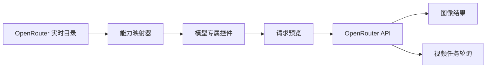

<div align="center">

# Oppa Gen

### 一个简洁的图像与视频生成工作区

选择 OpenRouter 模型，只显示它支持的控件，并在生成前检查实际发送的请求 JSON。

[](#项目状态)
[](https://tauri.app/)
[](https://react.dev/)
[](https://www.typescriptlang.org/)
[](https://www.rust-lang.org/)

[English](../../README.md) · [한국어](./README.ko.md) · **简体中文** · [日本語](./README.ja.md) · [Español](./README.es.md)

<br />


<br />

[为什么选择 Oppa Gen？](#为什么选择-oppa-gen) · [功能](#功能) · [工作原理](#工作原理) · [快速开始](#快速开始) · [安全性](#安全性) · [开发](#开发)

</div>

---

> **Oppa Gen** 将 OpenRouter 的实时模型元数据转化为专注的桌面工作区。选择模型、构建有效请求、预览 JSON，然后直接生成内容。

## 为什么选择 Oppa Gen？

不同生成模型的输入方式往往并不一致：有些支持种子和宽高比，有些需要首帧与尾帧，还有些可以接收多张参考图。Oppa Gen 会在运行时读取这些能力，并根据所选模型自动调整工作区。

| 不使用 Oppa Gen | 使用 Oppa Gen |
| --- | --- |
| 为每个模型反复查阅提供商文档 | 根据实时模型目录自动生成控件 |
| 猜测哪些字段有效 | 不支持的选项不会进入请求 |
| 手动编写 JSON 和图像数据 URL | 自动映射参考图与参数 |
| 自行实现视频任务轮询 | 恢复活动任务并持续轮询至完成 |

## 功能

- **实时模型发现** — 直接从 OpenRouter 加载图像与视频模型目录。
- **能力感知控件** — 只显示所选模型支持的参数。
- **图像与视频工作流** — 同时处理图像结果和异步视频任务。
- **灵活的参考素材** — 在模型支持时，将上传内容映射为普通参考、首帧或尾帧。
- **请求检查器** — 在发送前展示准确的 JSON，并在预览中省略体积较大的 base64 正文。
- **高级路由** — 可通过 JSON 添加提供商路由和透传设置。
- **任务连续性** — 记住活动视频任务，并在重启后继续轮询。
- **本地凭据存储** — 将 OpenRouter API 密钥保存在桌面应用的本地数据中，不写入请求预览或日志。

## 工作原理



1. Oppa Gen 获取实时图像与视频模型目录。
2. 所选模型的元数据决定显示哪些输入、参考素材和选项。
3. 提示词与设置会被转换为提供商可接受的请求。
4. 生成前可以检查经过清理的请求 JSON。
5. 图像会立即显示；视频任务会被保存并轮询至完成。

## 快速开始

### 前置条件

| 要求 | 说明 |
| --- | --- |
| Node.js | 24 或更高版本 |
| Rust | 当前稳定工具链 |
| Tauri 前置条件 | [Tauri 配置指南](https://v2.tauri.app/start/prerequisites/)中的平台依赖 |
| OpenRouter API 密钥 | 在 [OpenRouter 设置](https://openrouter.ai/settings/keys)中创建 |

### 运行桌面应用

```bash
git clone https://github.com/jbaehova/oppa-gen.git
cd oppa-gen/apps/desktop
npm install
npm run tauri:dev
```

应用打开后，请在 **Settings** 中添加 OpenRouter API 密钥，模型目录会自动加载。

## 安全性

在 Tauri 桌面应用中，OpenRouter 密钥存储于：

```text
~/.oppa-gen/credentials.json
```

- 在 macOS 和 Linux 上，目录权限限制为 `0700`，凭据文件权限限制为 `0600`。
- 密钥会在界面中遮盖，并从请求预览和应用日志中排除。
- 网络调用通过 Rust 进程代理，并且只允许应用使用的 OpenRouter 路径。
- 生成的视频缓存在操作系统的应用缓存目录中。

> [!NOTE]
> 仅浏览器运行的 Vite 开发页面会使用本地存储作为开发备用方案。桌面凭据处理请使用 Tauri 应用。

## 开发

在 `apps/desktop` 目录中运行检查：

```bash
npm run test:unit
npm run check
npm run build
cd src-tauri && cargo test
```

### 项目结构

```text
oppa-gen/
├── apps/desktop/
│   ├── src/                 # React 工作区与请求构建器
│   └── src-tauri/           # 凭据存储与 OpenRouter 代理
└── assets/readme/           # README 图像资源
```

请求构建逻辑位于 `apps/desktop/src/openrouter.ts`；原生安全边界与 OpenRouter 代理位于 `apps/desktop/src-tauri/src/lib.rs`。

## 项目状态

Oppa Gen 目前是 **Beta 软件**。请求层与核心桌面工作流已经就绪，打包、发布自动化和更广泛的提供商支持仍在持续完善。

<div align="center">

为希望灵活切换模型、又不想反复处理请求格式的创作者而打造。

[返回顶部](#oppa-gen)

</div>
